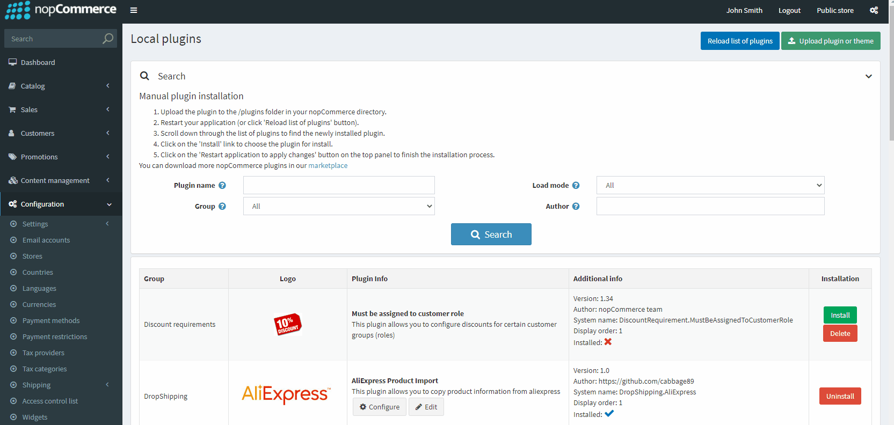
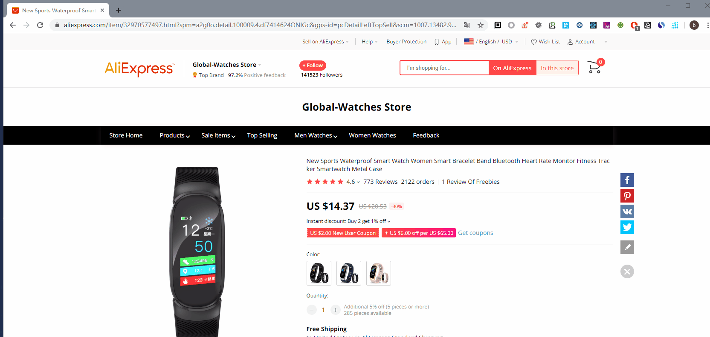
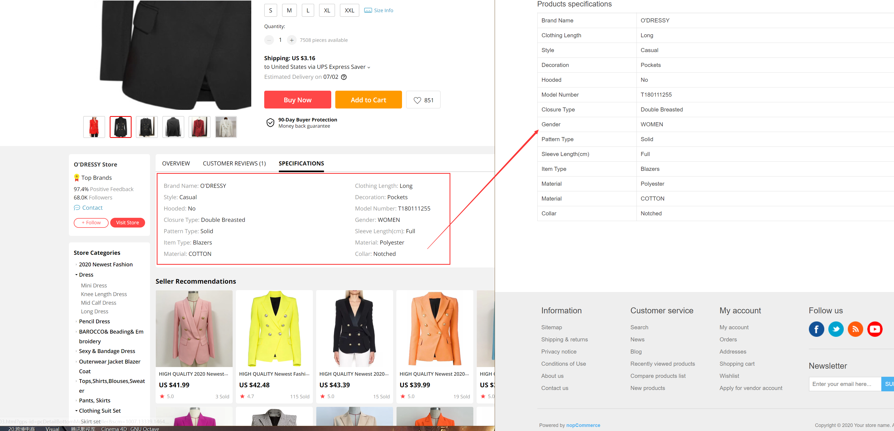
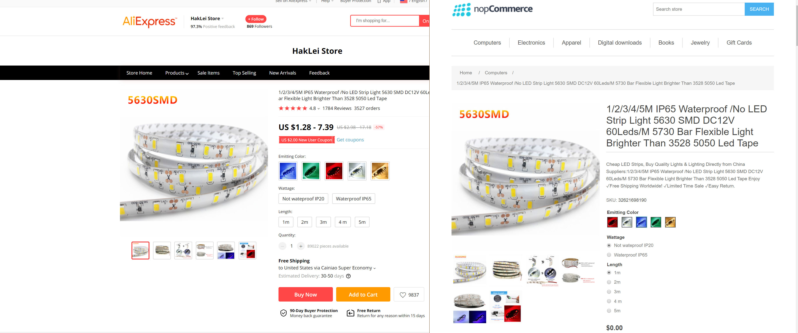
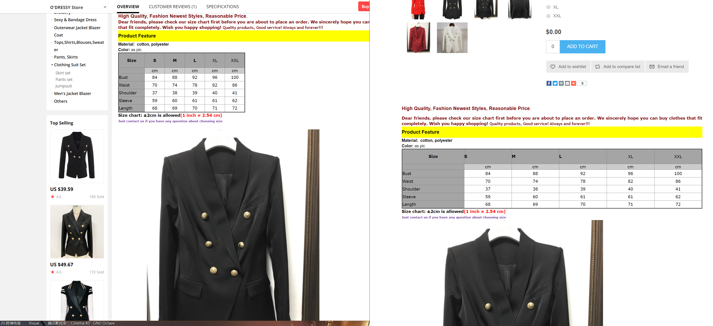

[在codester上购买](https://www.codester.com/items/25824/dropshipping-aliexpress-nopcommerce-plugin?ref=Tang)

### 插件功能介绍

此插件提供一个Chrome扩展，当您在[https://sale.aliexpress.com/](https://sale.aliexpress.com/)上时，页面上将会显示几个功能按钮。他们可以将该页面的产品信息快速导入到您的nopCommerce店铺中。它适用于nopCommerce Dropshipping模式

**使用步骤：**

1. 在nopCommerce插件市场上安装本插件	
2. 为chrome扩展配置安全访问令牌	
3. 在chrome安装扩展，并点击图标配置您的nop站点地址及安全访问令牌	
4. 在aliexpress网站上导入/更新/编辑您的产品信息	

**注意：**

1. 当前产品描述中的图片仍然外链至aliexpress	
2. 产品导入后默认没有发布，你需要发布后才可预览 
3. SKU多属性价格并未设置，您需要按照自己销售策略定价	

**功能清单：**

- 从AliExpress复制产品产品到您的nopCommerce网站上
- Chrome扩展支持`英文`和`简体中文`
- 产品信息包含seo相关信息，产品属性，特性，产品描述，产品图片
- 当您的店铺中已拥有当面AliExpress的产品，则会显示`更新`，`编辑`，`查看`按钮

### nopCommerce插件配置

### Chrome扩展配置

### 同步产品资料到nopCommerce

### 预览同步的产品

### 更新产品信息

### 案例

[在codester上购买](https://www.codester.com/items/25824/dropshipping-aliexpress-nopcommerce-plugin?ref=Tang)
