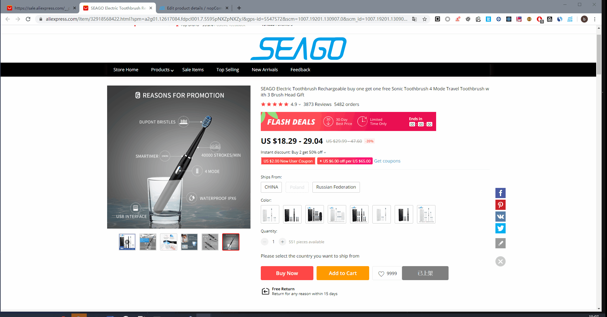

### 插件功能介绍

- 从AliExpress复制产品产品到您的nopCommerce网站上
- Chrome扩展支持`英文`和`简体中文`
- 产品信息包含seo相关信息，产品属性，特性，产品描述，产品图片
- 当您的店铺中已拥有当面AliExpress的产品，则会显示`更新`，`编辑`，`查看`按钮

### nopCommerce插件配置

### Chrome扩展配置

### 同步产品资料到nopCommerce

### 预览同步的产品

### 更新产品信息

### 案例

