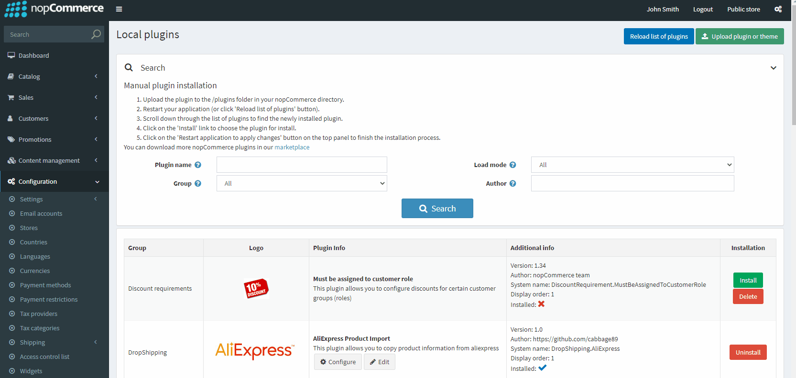
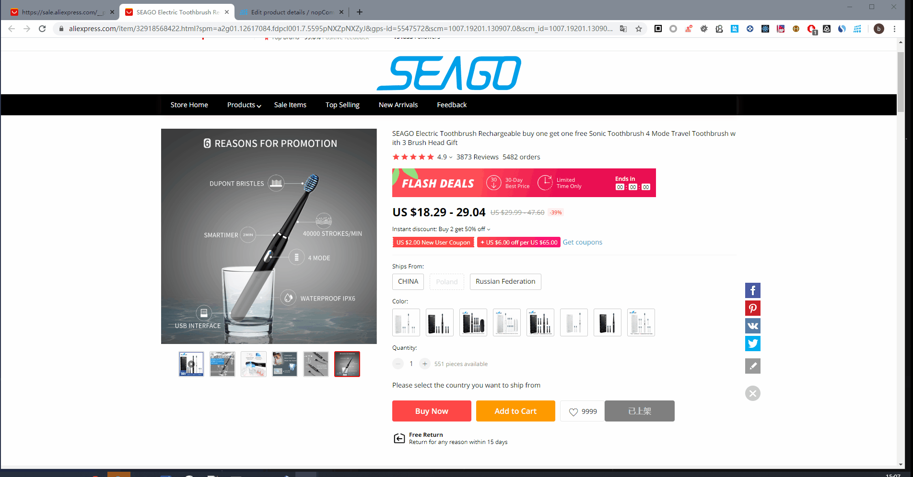
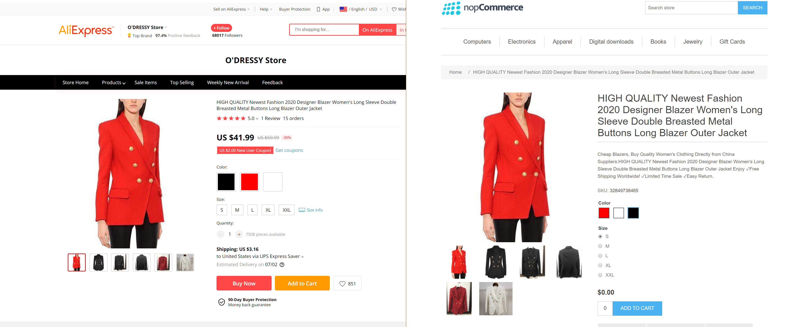
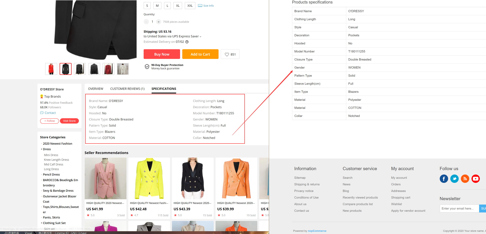
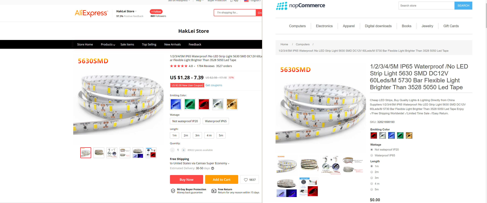
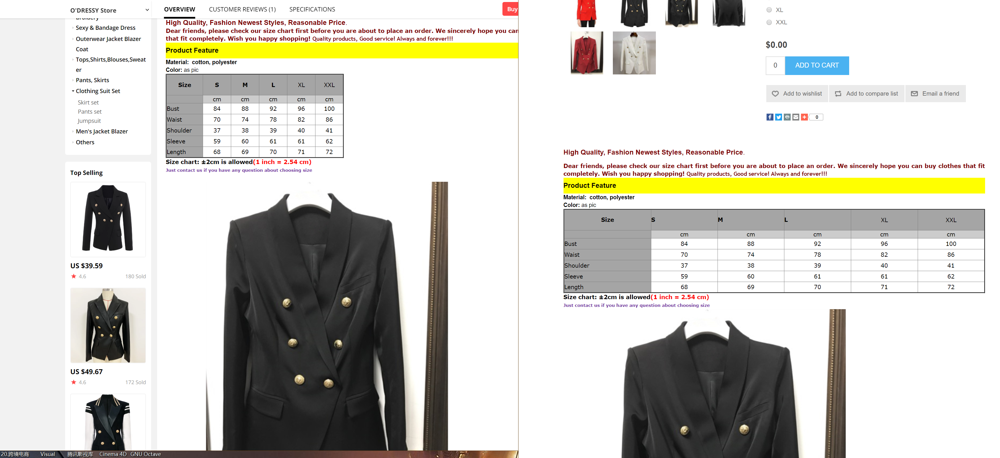

[**Buy on CodeSter**](https://www.codester.com/items/25824/dropshipping-aliexpress-nopcommerce-plugin)

### Introduction to the plug-in function

This plugin provides a Chrome extension. When you are on [https://sale.aliexpress.com/](https://sale.aliexpress.com/), several function buttons will be displayed on the page. They can quickly import product information from this page into your nopCommerce store.

**Steps for usage:**

1. Install this plugin on the nopCommerce plugin market	
2. Configure security access token for [chrome extension](https://github.com/cabbage89/Nop.Plugin.DropShipping.AliExpress.ChromeExt)	
3. Install the extension in chrome and click the icon to configure your nop site address and security access token	
4. Import/update/edit your product information on the aliexpress website	

**note:**

1. The pictures in the current product description are still linked to aliexpress
2. After the product is imported, it is not released by default. You need to publish it to preview it.
3. SKU multi-attribute price is not set, you need to price according to your sales strategy

**Feature list:**

- Copy products from AliExpress to your nopCommerce website	
- Chrome extension supports `English` and `Simplified Chinese`	
- Product information contains seo related information, product attributes, features, product descriptions, product pictures	
- When your store already has AliExpress products in front of you, it will show `Update`, `Edit`, `View` buttons	

**Supported version**

Support for versions after `4.3`, because it is built on .NET CORE and depend on `LinqToDB`, this plugin was successfully tested on `4.4`.  

How to support `4.3`? 

Modify `plugin.json` in the plugin source code  

```json
"SupportedVersions": [ "4.30" ],
```
Then rebuild in visual studio

### nopCommerce plugin configuration



### Chrome extension configuration


### Synchronize product information to nopCommerce


### Preview synchronized products


### Update product information



### Case






[**Buy on CodeSter**](https://www.codester.com/items/25824/dropshipping-aliexpress-nopcommerce-plugin)
